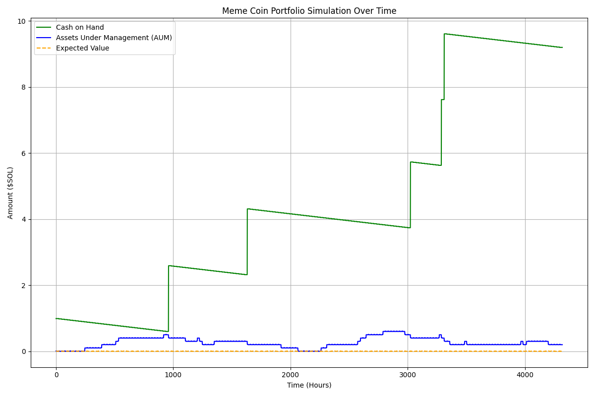

# memecoin-portfolio-simulation
Ok you are buying and selling coins, but how should you do it? How do you make sure your strategy actually works? Here is a simple tool to play out your strategy and see if you make bank or go broke



## Installation

You need python >= 3.8


```bash
git clone https://github.com/DevNotFLeavin/memecoin-portfolio-simulation.git
cd memecoin-portfolio-simulation

# On Windows
python -m venv venv
venv\Scripts\activate

# On macOS/Linux
python3 -m venv venv
source venv/bin/activate

pip install -r requirements.txt

```

## Usage

```python
python dnfl_portfolio_simulation.py
```

## Contributing

Pull requests are welcome. For major changes, please open an issue first
to discuss what you would like to change.

Please make sure to update tests as appropriate.

## License

[MIT](https://choosealicense.com/licenses/mit/)
